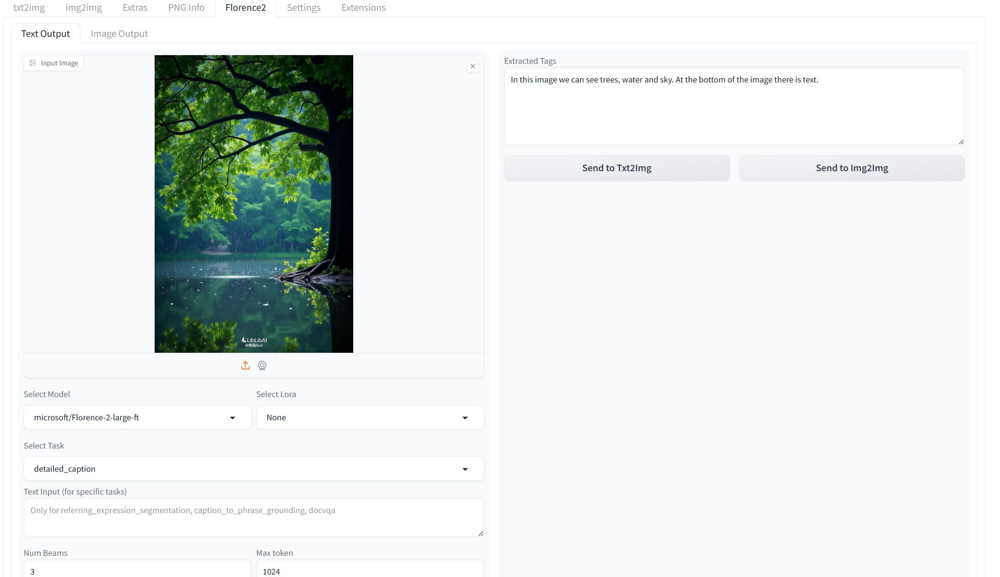
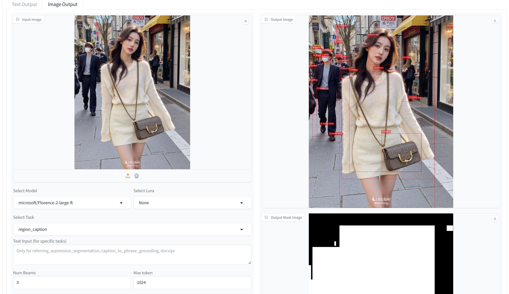

# sd-forge-florence2-tagger
A web UI plugin for a Florence2 reverse inference model，support sd-webui-forge and Neo

## Interface

  
  
<em>text</em>

  
  
<em>image</em>

  
Support batch process;

Place model files in `SD-WebUI-Forge/model/tagger_models`;

You need to download all of config file for Florence model.

## Reference Links

1. **Project Homepage**: [https://github.com/Tao256/sd-forge-florence2-tagger](https://github.com/Tao256/sd-forge-florence2-tagger)
2. **Stable Diffusion WebUI Neo**: [https://github.com/Haoming02/sd-webui-forge-classic](https://github.com/Haoming02/sd-webui-forge-classic)
3. **ComfyUI-Florence2**: [https://github.com/kijai/ComfyUI-Florence2](https://github.com/kijai/ComfyUI-Florence2)
